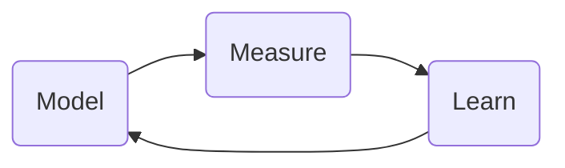

---
---

# Hyperparameter tunning in python

#hyperparameter_tunning

## Introduction
- How to find optimal combinations of hyperparameters?

### Parameters overview
- Components of the model learned during the modeling process
- You do not set these manually!!

### Introducing Hyperparameters

- They are set before the modeling process
	- They should also be tunned

##### For Random Forest 😀
Important hyperparameters (commonly):
- `n_estimators`: number of trees -> 300, 500, 1000
- `max_features`: How many features to consider when splitting
- `max_depth` and `min_sample_leaf`: important for overfitting -> lower == more regularization

### Setting & Analyzing hyperparametr values

- Some hyperparameters are more important than others
- The values and hyparams are specific to the ML model
- Some hyparameters has conflict with others (in `scikit-learn`)
- Some values could be valid but could be a bad idea.
- Increasing by very small amount maybe will not have a significant impact over the performance.

#### Learning Curves
#Learning-curves

```python
neighbors_list = list(range(5, 500, 5))
accuracy_list = []
for test_number in neighbors_list:
	model = KNeighborsClassifier(n_neighbors=test_number)
	predictions = model.fit(X_train, y_train).predict(X_test)
	accuracy = accuracy_score(y_test, predictions)
	accuracy_list.append(accuracy)
results_df = pd.DataFrame({'neighbors': neghbors_list,
						  'accuracy': accuracy_list})

plt.plot(results_df['neighbors'], results_df['accuracy'])
plt.show()
```


## Grid Search

### Grid Search Selection

Grid Search Pros and Cons:
- Computationally expensive.
- It is #uninformed -> Results of one model don't help creating the next model.

### Grid search with Scikit Learn

```python
from sklearn.model_selection import GridSearchCV

GridSearchCV(
	estimator, param_grid,
	scoring=None,
	iid='warn',
	refit=True,
	cv='warn',
	verbose=0,
	pre_dispatch='2*n_jobs',
	error_score='raise-deprecating',
	return_train_score='warn'
)
```


### Understanding grid search output

`GridSearchCV` properties:
- A result log -> 
	- `cv_results_`: A dictionary with the full results
	- `cv_results_df = pd.DataFrame(grid_cv_res.cv_results_`
		- Each row is a model
		- The `rank_test_score_` tell us the ranking of the model
- The ==best results== -> 
	- `best_index_`
	- `best_params`: Parameters of the best
	- `best_score_`: Score of the best
- The best estimator fitted ->
	- `best_estimator_`: Trained if `refit=True`
- Extra information ->
	- `scorer_`
	- `n_splits_`
	- `refit_time_`


## Random Search

- Very similar to grid search.
- But it will randomly select the grid squares.

**Why does this work?**
Bengio & Bergosa, 2012 ->
> This paper shows empirically and theoretically that randomly chosen trials are more efficient for hyperparameter optimization than trials on a grid.

Two main reasons:
1. Not every hyperparameter is as important
2. A ==little trick of probability== 😱🤯😎
	- Assuming a 0.05 chance of success
	- With $n$ trials, we will have $(1 -0.05)^n$ chance that every single trial misses that desire spot.
	- So, 🚨 ==how many trials to have a 95% chance of getting one of the best spots?==
		- $1 - (1 - 0.05)^n \geq 0.95$
		- give us ==$n \leq 59$== ❣️

Remember:
- The maximum is still only as good as the grid we set!
- To compare agains the *Grid Search* we need to set the same set of parameters

### Random Search in Scikitlearn

Two key differences:
- `n_iter`: number of samples for the random search to take from your grid
- `param_distributions`: it is slightly different form `param_grid`, allowing optional ability to set a distribution for sampling.
	- Some combinations have ==different chances== to be chosen

### Comparing Grid and Random Search

**Similarities:**
- both are automated ways of tuning different hyperparameters
- For both we set the grid to sample form
- Both use cross-validation and a scoring

**Differences:**
- **Grid Search:**
	- Exhaustive search
	- No sampling methodology
- **Randomized Search:**
	- Randomly selects a subset of combinations within the sample space
	- Can select a sampling methodology -> Other than uniform
	
	
## Informed Search
	
#### Informed vs uninformed Search
	
**==Uninformed==** Search: 
- Each iteration of hyperparameter tunning *does not learn from the previous iterations*.
- Allows to parallelize the work

**==Informed==** Search: 
- Builds the model sequentially
- Learning from each iteration




### Coarse to Fine Tuning

**A based informed search methodology**
- **It is not informed per model, but per batches of models**
- *Start out with a rough, random approach and  iteratively refine your search*

**The process:**
1. Random search
2. Find promising areas
3. Grid search in the smaller area (Or even an inner random search)
4. Continue until optimal score obtained

**Advantages:**
1. Wide search to begin with
2. Deeper search once you know where a good spot is likely to be.
3. Better spending of time and computational efforts

### Bayesian Statistics
#Bayes
**Bayes Rule:**
- A statistical method of using new evidence to iteratively update our *beliefs* about some outcome
--> ==Getting better as we get more evidence==

$$P(A | B ) = \frac{P(B | A) P(A)}{P(B)}$$

- $B$ is some new evidence.
- $P(A)$ is the *prior* --> The ==initial hypothesis== about the event...
- $P(A | B)$ is the probability given **new evidence**.
	--> the *posterior*
- $P(B)$ is the ==*marginal lkelihood*== and is the probability of observing this new evidence.
- $P(B | A)$ is the ==likelihood== which is the probability of observing the evidence --> given the evidence we care about. 

#### Bayes in Hyperparameter Tuning

We can apply this logic to hyperparameter tuning:

1. Pick a hyperparameter combination
2. Build a model
3. Get new *evidence* (the score of the model)
4. Update our beliefs and chose better hyperparameters next round

#### The package `Hyperopt`
#hyperopt_package
To undertake **bayesian** hyperparameter tuning with the `Hyperopt` package, we need to:
1. **Set the Domain** --> Our grid (with a bit twist)
	- *Does not use point values on the grid but instead each point represents probabilities for each hyperparameter value.*
	- ==We can use different distributions==
2. Set the **Optimization algorithm** (use default TPE algorithm)
3. **Objective function** to minimize --> we will use $1 - Accuracy$ > because it minimizes


##### The domain

1. Set up the grid (with quantized uniform distribution) ->

```python
from hyperopt import  hp

space = dict(
	max_depth = hp.quniform('max_depth', 2, 10, 2),
	min_samples_leaf = hp.quniform('min_samples_leaf', 2,8, 2),
	learning_rate = hp.uniform('learning_rate', 0.01, 1, 55)
)
```

2. Define the objective function -->

```python
def objective_fn(params):
	# Parameters to test
	params = {
		'max_depth': int(params['max_depth']),
		'min_samples_leaf': int(params['min_samples_leaf']),
		'learning_rate': params['learning_rate']
	}
	
	# Estimator
	gbm_clf = GradientBoostingClassifier(
		n_estimators=500,
		**params
	)
	
	# The estimator is cross validated to find the best score
	best_score = cross_val_score(
		gbm_clf, X_train, y_train,
		scorting='accuracy', cv=10, n_jobs=4
	).mean()
	
	# Define the loss (min is better)
	loss = 1 - best_score
	
	return loss
```

3. Run the algorithm -->

```python
from hyperopt import fmin, tpe, hp

best_results = fmin(
	fn = objective_fn,
	space = space,
	max_evals = 500,
	rstate = np.random.RandomState(42),
	algo = tpe.suggest()
)
```

### Genetic Algorithm

#genetic_algorithm

##### The basic implementation

Genetic algorithms applied to hyperparameter tuning:
1. Create a population of models (with its hyperparameters) -> ==offspring==
2. Pick the model with the best ==fitness== --> `scoring` - `accuracy`, etc.
	- These are the ones that *survive*
3. Create ==new models== that are similar to the best ones.
	- Gen 2 `offspring` 
4. Add some randomness (==mutation==)  and ==corssover== between parents
	- This could affect the ==fitness==
5. Repeat until convergence

##### Why does this work well?

- ✅  It allows us to learn from previous iterations
- ✅  It has the additional advantage of some randomness
- 🚨 TPOT is quite unstable when not run for a reasonable amount of time.
	- Increasing the generations, population size and offspring and running this for a long time will assist to produce better models and more stable results.

#### The TPOT libray
![[Captura de Pantalla 2021-03-02 a la(s) 12.45.16.png]]
#TPOT ☕️

==TPOT== -> A useful library for genetic hyperparameter tuning.
> *Consider TPOT as your data science assistant. TPOT is a python automated machine learning tool that optimizes machine learning ==pipelines== using genetic programming*

- The pipelines not only include the model but also work on features and other aspects of the process.
- It returns the python code of the pipeline!!

##### TPOT components
Key arguments of a TPOT classifier:
- `generations`: Iterations to run training for.
- `population-size`: The number of models to keep after each iteration.
- `offspring_size`: Number of models to produce in each iteration.
- `mutation_rate`: The proportion of pipelines to apply randomness to.
- `crossover_rate`: The proportion of pipelines to breed each iteration
- `scoring`: The function to determine the best models
- `cv`: Cross-validation strategy to use.

###### A simple example

- 🤯 Here TOPOT will also select the best sklearn estimator and its hyperparameters by itself!! 🤯

```python
from tpot import TPOTClassifier
# Create the estimator as with sklearn
tpot = TPOTClassifier(
	generations =3,
	population_size = 5,
	offspring_size = 10,
	scoring = 'accuracy',
	cv =5,
	verbosity = 2
)

# Fit the estimator
tpot.fit(X_train, y_train)

print(tpot.score(X_test, y_test))
```
