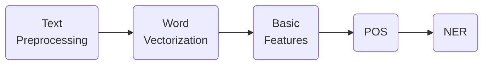
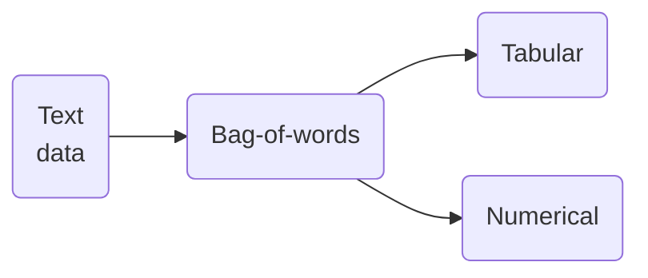
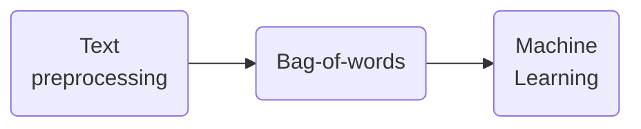
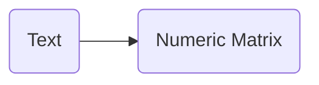

---
---

# Feature engineering for NLP in python


## Basic features and readability scores

### Introduction to NLP feature engineering

- Numerical features -> #One-hot-encoding 

### Basic Feature Extraction
1. Number of characters
2. Number of words
3. Average word length
4. Special Features
5. Number quantities
6. All-Capital words


##### NLP Feature engineering steps



### Readability test
- It indicates at what educational level a person needs to be to comprehend the text.
- It ranges from a primary school up to college graduate level
- It a mathematical formula utilizing word, syllable, and sentence count

##### Flesch reading ease
- One of the most oldest and used tests. => The harder is the text the lower the score.
- Depends of two factors:
	1. Greater the average sentence is -> the harder the text
	2. Greater the number of syllables in a word -> harder the text

##### Gunning fog index
- Developed in 1954
- Also dependt on average sentence length
- Higher index, lesser the readability

![[Captura de Pantalla 2021-03-13 a la(s) 22.18.43.png]]

#### `textatistic` library

```python
from textatistic import Textatistic

# Create a Textatistic Object
readability_scores = Textatistic(text).scores

# Generate the scores
readability_scores['flesch_score']
readability_scores['gunningfog_score']
```

***
# Text preprocessing, POS tagging and NER

### Tokenization and Lemmatization


#### Tech preprocessing techniques
- Converting words into lowercase
- Removing leading and trailing whitespaces
- Removing punctuation 
- Removing stopwords
- Expanding contractions
- Removing special characters

##### Tokenization using `spaCy`
Tokenization -> [[introduction_to_natural_lenguage_processing#Introduction to tokenization]]
Process of splitting a string into its constituent tokens.
- We can do this with `spaCy` using a pre-trained English model => `en_core_web_sm`


```python
import spacy

# Load the en_core_web_sm model
nlp = spacy.load('en_core_web_sm')
# Initialize the string
string = 'My string ... bla bla'
# create a Doc object
doc = nlp(string)

# Generalize a list of tokens
tokens = [token.text for token in doc]
```

##### Lemmatization using `spaCy`
Lemmatization -> [[introduction_to_natural_lenguage_processing#Stopwords and Lemmatization]]
It is the process of **convert word into its base form**.
- -> `reducing`, `reduces`, `reduced`, `...` => `reduce`
- -> Convert words with apostrophes into full words. 
- `spaCy` generates the lemmatization by default:

```python
import spacy
# Load the pretrained model
nlp = spacy.load('en_core_web_sm')
# Declare the string
string = '...'
# Create the Doc object
doc = nlp(string)

# Generate a list of lemmas
lemmas = [token.lemma_ for token in doc]

# Convert the lemmas into a string
' '.join(lemmas)
```


### Text cleaning
**Some of the most common cleaning steps include:**
- Removing extra whitespaces and scape sequences
- Punctuation
- Special characters (numbers, emoji)
- Stopwords (so common words)
	- Articles, be verbs, pronouns
- Removing `HTML`
- Replacing special characters like accented characters
- Correcting spelling errors

```note-danger
The use depends on the application
```

##### Removing stop words with spaCy

```python
# Get a list of stopwords
stopwords = spacy.lang.en.stop_words.STOP_WORDS
strin = '...'
# Remove stopwords and non alphabetical words
lemmas = [lemma for lemma in lemmas
		 if lemma.isalpha() and lemma not in
		 stopwords]
```

A function to apply over a pandas dataframe

```python
# Function to preprocess text
def preprocess(text):
  	# Create Doc object
    doc = nlp(text, disable=['ner', 'parser'])
    # Generate lemmas
    lemmas = [token.lemma_ for token in doc]
    # Remove stopwords and non-alphabetic characters
    a_lemmas = [lemma for lemma in lemmas 
            if lemma.isalpha() and lemma not in stopwords]
    
    return ' '.join(a_lemmas)
```


### Part-of-speech tagging
```query
POS-tagging
```

- #POS-tagging is one of the most used techniques for #NLP ->
	- ==Assigning every word its corresponding part of speech==
	- spaCy can identify around 20 POS
	- Example:
		- **`Brownie is a little perro shiquito`**
		- **POS tagging:**
			- `Brownie` -> proper noun
			- `is` -> verb
			- `a` -> determiner
			- `little` -> adjective
- Applications:
	- Word-sense disambiguation.
	- [[Sentiment Analysis]]
	- Question answering
	- Fake news and opinion spam detection:
		- *Fake news headlines, on average, tend to use lesser common nous and more proper nouns than real headlines.*

#### POS-tagging using spaCy

```python
import spacy
nlp = spacy.load('en_core_web_sm')
string = '...'
doc = nlp(string)

# POS tagging
pos = [(token.text, token.pos_)
	   for token in doc]
```
```output
[('Jane', 'PROPN'),  
('is', 'VERB'),  
('an', 'DET'),  
('amazing', 'ADJ'),  
('guitarist', 'NOUN')]
```

### Named entity recognition
- ==**Named entity:**== -> Anything that can be denoted with a proper name or a proper noun.
- #NER is the process of identifying such named entities.
- **Categories**:
	- `Person`
	- `Organization`
	- `Country`

Applications:
- Efficient search algorithms
- Question answering
- New article classification

#### NER using spaCy
- `spacy` is capable of identifying more than 15 categories of named entities.

```python
import spacy
nlp = spacy.load('en_core_web_sm')
string = '''
John Doe is a software 
engineer working at Google. 
He lives in France
'''

doc = nlp(string)

# NER
ne = [(ent.text, ent.label_)
	  for ent in doc.ents]
```
```output
[('John Doe', 'PERSON'), 
 ('Google', 'ORG'), 
 ('France', 'GPE')]
```

***

## N-gram models

### Building a bag of words model
#BOW-nlp
- For every ML model:


- `Bag-of-words` => 
	- Extract tokens -> ==Vocabulary==
	- Compute frequency of word tokens
	- Construct a word vector out of these frequencies and vocabulary of **corpus** (set of documents)

#### BOW using `sklearn`

- Using `CountVextorizer` from scikit-learn
	- It automatically lowercases words and ignores single character tokens
	- Do not order the vocabulary in alphabetical order

```python
from sklearn.feature_extraction.text import CountVectorizer

corpus = ['text 1', 'text 2', 'text 3']
# Instantiate the vectorizer
vectorizer = CountVectorizer()
# Create matrix of word vextors
bow_matrix = vectorizer.fit_transform(corpus)
# Convert bow_matrix into a DataFrame
bow_df = pd.DataFrame(bow_matrix.toarray())
# Map the column names to vocabulary 
bow_df.columns = vectorizer.get_feature_names()
```

### Building a BoW Naive Bayes Classifier
#NaiveBayes 

#### Example: Spam filtering problem


##### Text processing using `CountVectorizer`



Arguments of `CountVectorizer`:
- `lowercase`: False or True
- `strip_accents`: Unicode, ascii, None
- `stop_words`: 'english', list, None
- `token_pattern`: regex
- `tokenizer`: function
- Do not performs lemmatization

###### Building the BoW model

```python
from sklean.feature_extraction.text import CountVectorizer
from sklearn.model_selection import train_test_split

vectorizer = CountVectorizer(strip_accents = 'ascii',
							stop_words='english',
							lowercase=False)

# Train test split the data
X_train, X_test, y_train, y_test = \
	train_test_split(df['message'], df['label'],
					test_size = 0.25)

# Transform the X sets
X_train_bow = vectorizer.fit_transform(X_train)
X_test_bow  = vectorizer.transform(X_test)
```

##### Training the Naive Bayes Classifier

```python
from sklearn.naive_bayes import MultinomialNB

clf = MultinomialNB()
clf.fit(X_train_bow, y_train)
# Compute accuracy on test set
accuracy = clf.score(X_test_bow, y_test)
```


### Building n-gram models
🚨 -> Two text could have the same BoW representation:
- `The movie was good and not boring` -> Positive
- `The movie was not good and boring` -> Negative

#### n-gram with `n > 1`
- Contiguous sequence of `n` elements (words) in a given document.
	- Let us to capture more context.
	- Applications:
		- Sentence completion
		- Spelling correction
		- MAchine translation correction
- ==BoW== is an **n-gram** where `n=1`.
- The ==weight of dimension== depends on the **frequency** of the word corresponding to the dimension.

[695 × 286](https://www.google.com/url?sa=i&url=https%3A%2F%2Fdeepai.org%2Fmachine-learning-glossary-and-terms%2Fn-gram&psig=AOvVaw2elHN0kW_VnWcwdBCrSsFW&ust=1616373261412000&source=images&cd=vfe&ved=0CAIQjRxqFwoTCKjP3OORwO8CFQAAAAAdAAAAABAD)

##### Building n-gram models using sklearn
```python
# Generate unigrams, bigrams, and trigrams
ngrams = CountVectorizer(ngram_range = (1,3))
```

#### Shortcomings 🚨 
- Course of dimensionality 
- Higher order n-grams are rare
- Better to keep `n` small

***
## TF-IDF and similarity scores
### Building #tf-idf document vectors
**Motivation** => Depending on the corpus, some words occur very commonly across all documents.
- -> More **exclusive** words should have a **larger** weight

Applications:
- Automatically detect stopwords
- Search
- Recommended systems
- Better performance for predicting modeling

#### Frequency-inverse document frequency
- The weight of the term should be proportional to term frequency. Inverse function of the number of documents in which it occurs.

- The weight  $w$ of a term $i$ in document $j$ is computed as:
$$w_{i,j} = tf_{i,j} \cdot log\left(\frac{N}{df_i}\right)$$

- $tf_{i,j}$ -> term frequency of term $i$ in document $j$
- $N$ -> number of documents in the corpus
- $df_i$ -> number of documents containing term $i$

- A high $w_{i,j}$ value would imply that the word is very particular to that document or that the word appears too much in that document (or both)

##### tf-idf using sklearn

```python
from sklearn.feature_extraction.text import TfidfVectorizer

vectorizer = TfidfVectorizer(stop_words='english')
# Generate matrix of word vectors
tfidf_matrix = vectorizer.fit_transform(corpus)
# The resulting weights are not integers
```

### Cosine similarity
#cosine_similarity_score => one of the most used metrics for similarity in #NLP 
- Varies between -1 and 1
- In NLP almost always the values are varies from 0 to 1
- Robust to document length

![[Captura de Pantalla 2021-03-20 a la(s) 18.15.10.png]]

> The cosine similarity between the vectors:

$$sim(A,B) = cos(\theta) = \frac{A\cdot B}{||A|| \cdot||B||}$$

> It is the ratio of the dot product of the vectors divided by the product of the magnitude of the vectors.

##### Cosine similarity with sklearn
```python
from sklearn.metrics.pairwise import cosine_similarity

score = cosine_similarity(Vector1, Vector2)
```

##### Linear kernel
- Because the magnitude of a tf-idf vector is 1 we can omit the computation of #cosine_similarity_score because it will be the same as the dot product (as multiplying the magnitudes will give us 1)

```python
from sklearn.metrics.pairwise import linear_kernel

score = linear_kernel(Vector1, Vector2)
```

### Building a plot line based recommender

##### Steps
1. Text preprocessing
2. Generate tf-idf vectors
3. Generate cosine similarity matrix

##### The recommender function
1. Take a movie title, cosine sim. matrix and indices series as arguments.
2. Extract pairwise cosine sim. scores for the movie.
3. Sort the scores in descending order.
4. Output titles corresponding to the highest scores.
5. Ignore the highest similarity score.

## Word Embeddings
#word-embedding  is a process to mapping words into an n-dimensional vector space.
- The vectors are usually produced by deep learning and huge amounts of data.
	- Not trained on user data.
- Once generated they could be used to discern how similar two words are to each other.
	- Synonyms and antonyms
	- Able to capture complex relationships.


### Word embeddings with spaCy
```python
import spacy

nlp = spacy.load('en_core_web_sm')
doc = nlp('text')

# Generate word vectors for each token
word_vectors = [token.vector for token in doc]
```

##### Word similarities using word-embedding
```python
token1.similarity(token2)
```

##### Document similarities using word-embedding
```python
doc1 = nlp('text doc1')
doc2 = nlp('text doc2')

# Compute the similarity
doc1.similarity(doc2)
```

![[Captura de Pantalla 2021-03-20 a la(s) 19.08.39.png]]