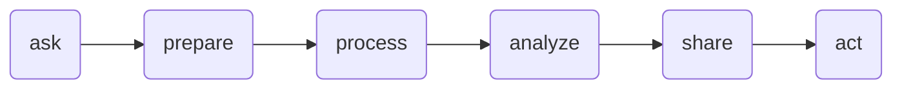

---
---

# Welcome to Google Data Analystics Certificated

## Week 1
#### Data 
Data is a collection of facts
	- Many types

#### Data analysis
- The collection, transformation, and organization of data in order to draw conclusions, make predictions, and drive informed decision-making.
	- -> collection, transformation, and organization
	- <- draw conclusions, predictions, decision-making

#### Data analyst
- Someone who collects, transforms, and organizes data in order to help make informed decisions

### Process

Helpful habits for successfully completing the certificate:
1. Plan your time
2. Learn in order
3. Be curious
4. Take notes
5. Chat with other learners