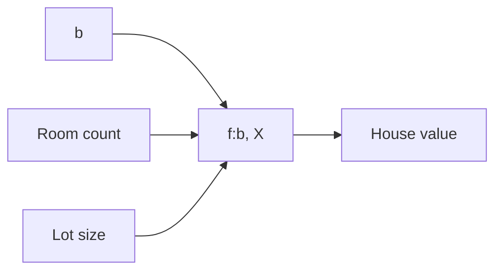
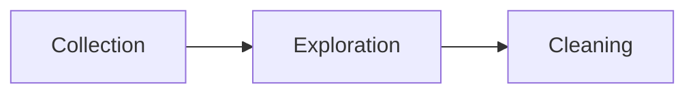

---
---

# Example 1
## Supervised Learning
Using machine learning to predict housing prices in a neighborhood based on lot size and number of bedrooms

- The model

#### S1: Define the problem
> *Can we estimate the price of a house based on lot size or the number of bedrooms?*

- ML Taks
	- ->Supervised Learning
		- --> Regression task

#### S2: Building a dataset

- ==Data Collection: ==
	- Collect examples
- ==Data Exploration:==
	- Confirm data is numerical
- ==Data cleaning:==
	- Look for missing values
	- Check for outliers
- ==Data Visualization:==
	- Scatterplots between independent and dependent variables
	- Data distribution using histograms
	- Check if the data follows a lineal trend

#### S3: Model Training
- Split the dataset
	- Train
	- Validation
	- Test

#### S4: Evaluation
- Use RMS

# Example 2
## Unsupervised learning
Using machine learning to isolate micro-genres of books by analysing the wording on the back cover description

# Example 3
## Deep learning
Analyze raw images from lab video footage from security cameras, trying to detect chemical spills.