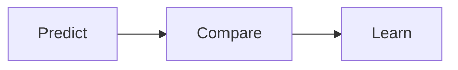
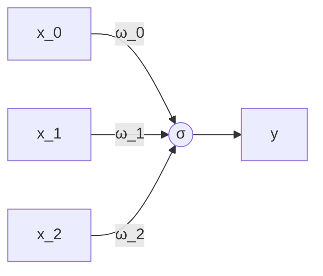
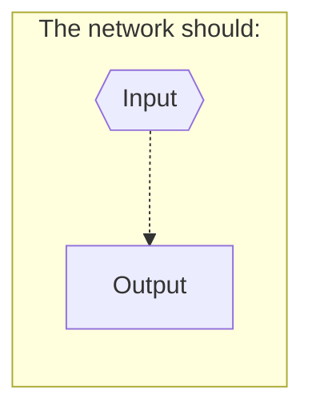

---
---

# Gradient Descent
#grokking

> The only relevant test of the validity of a hypothesis is comparison of its predictions with experience



### Predict




### Compare
==Compare==: It gives a measurement of how much a prediction "missed" by.
- Error is always positive.
	- It is a "hot or cold" type signal
- This step	tells you how much you missed -> But it wont tell you why you missed, what direction you missed or what you should  to fix the error.
	
#### Why measuring error?
Measuring error simplifies the problem
- The #Network shoult take an input should be easy to measure to predict with it things that are hard to calculate.


Different ways of measuring error -> Prioritize error differently
- The error should be always positive
- Absolute error:
	- 
- Squaring the error:
	- Force the error to be positive
	- Numbers `< 1` get smaller and `> 1` get higher

	
### Learn
==**Learn**==: Tell each weight how it can change to reduce the error.
- Learning is all about *error attribution* => Figure out how each weight played its part in creating error.
- It is the *blame game* of deep learning.
- How the weights should be changed (should be higher or lower) to reduce the error?

#### History
- [[Rosenblatt Algorithm:]]:
	- He purpose an algorithm to automatically update the weights

#### The simplest form of neural learning
- Learning is a search problem:
	- Find the best ω values that minimize the error.
	- The best possible configuration of weights so the network's error falls to 0


##### Characteristics of hot and cold learning
> ==**Hot and cold learning**==
> Hot and cold learning means wiggling the weights to see which direction reduces the error the most, moving the weights in that direction, and repeating until the error gets to 0.


- **It is simple**: 
	- First make a simple prediction
	- Then predict two more times, with a slightly lower and higher weight, respectively.
	- Measure both errors.
	- Chose the best direction (that minimizes the error) to update the weights.

- **It is inefficient**:
	- You need to do a lot of predictions and measurements.
	
- **It is impossible to predict the exact goal prediction**
	- Because the step amount is always constant
		- You only will know the direction but not the amount of movement
	- It could never converge

### Gradient descent
##### Calculate both direction and amount form error
```python
w = 0.5
y = 0.8
X = 0.5

for i in range(20):
	pred = X * w
	error = (pred - y) 
	sq_error = error ** 2
	#******************** 
	# Calculate the direction and the amount
	d_and_h = error * X
	#******************** 
	w = w - d_and_h
```
- Multiplying the **_pure error_** against the *input* => performs scaling, negative reversal, and stopping
	- This translates the pure error to the absolute amount you want to change *weight*.
	- ==Stopping==:
		- If input is 0 it will force the direction and amount to also be 0
	- ==Negative reversal==:
		- Ensures that weight moves the correct direction even if input is negative.
	- ==Scaling==:
		- If the input is big, the weights should be also big.
		- But it could be out of control...
			- $\alpha$ helps to solve this problem


