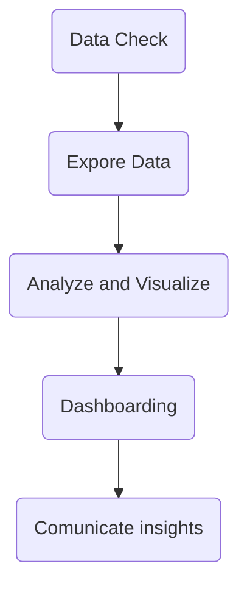

# Job Market analysis with Power BI

## Case of study
### Data Analytics pipeline with Power BI

![[Captura de Pantalla 2022-05-25 a la(s) 18.27.47.png]]

### Problem to solve
 *Investigate the market trends for data science roles*
 
 - ==The context==:
	 - An employee recruiting firm, *DataSearch*, needs to uncover job trends
 - ==The task==:
	 - Discover trans in jobs and skills withing the data science industry
- ==The dataset==:
	- A fictitious collection of key details from job postings
	- Key details from job postings from 2017 to 2021 for jobs in the data science industry
	- Each row correlates to a specific job posting in time
	- One table containing 19 columns
		- Qualitive and Quantitative Columns

![[Captura de Pantalla 2022-05-25 a la(s) 18.41.50.png]]