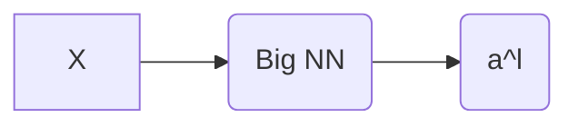
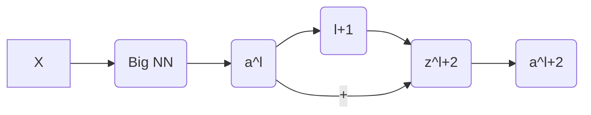

---
---

# ResNets

- In practice, very *plain* Deep networks 
	- Get worse performance on the training set as more layers are added
	- Because -> Vanishing and Exploding gradients
- #ResNets enable to train very deep neural networks
	- They use Residual blocks
- This allows to train deeper neural networks

### Residual Blocks

- The use of ==skip connections==:
	- $$a^{l+2} = g(z^{l+1} + a^l)$$
		- In this example the $l+1$ layer was skipped

	- 🔴  ==NOTE==: $z^{l+1}$ and $a^l$ need to have the same dimensions.
	- Therefore, these layers tend to use the `same` ==padding==, to preserve the input dims after the convolution.
	- In other cases, a new matrix $W_s$ is multiplied by $a^l$ in order to match the dimensions of $z^{l+2}$

In the example above, $a^l$ skips the second layer and reaches the third activation

- The shortcut is added before the *activation*

![[Captura de Pantalla 2021-11-21 a la(s) 18.41.59.png]]

### Residual Networks
![[Captura de Pantalla 2021-11-21 a la(s) 18.44.03.png]]

## Why ResNets work?

> The identity function is easy for Residual Networks to learn.

Adding more layers to the network does not hurt the network:

Given two Neural networks:

![[Captura de Pantalla 2021-11-21 a la(s) 19.11.42.png]]
		
#### A plain NN

If we have vanished gradients, because of the two new layers, with $a^{l+2} = g(z^{l+2})$ suffering from it, meaning that $a^{l+2} = 0$
 - Because $z^{l+2} = W^{l+2}a^{l + 1} + b^{l+2} =0$
- Because $W^{l+2} = 0$ and $b^{l+2} = 0$

For the plain NN, $a^{l+2} = 0$ because of the two new layers.

#### A ResNet
- A ResNet with two extra layers

If we have vanished gradients, because of the two new layers, with $a^{l+2} = g(z^{l+2})$ suffering from it, $a^{l+2}$  will be **safe** because of the skipping connection:

For the plain NN, at least $a^{l+2} \ge g(a^{l})$ because of the addition of the skipped connection

![[Captura de Pantalla 2021-11-21 a la(s) 19.05.40.png]]