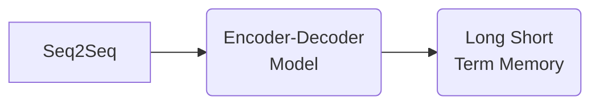

---
---

# Seq2Seq

### About Seq2seq

The *seq2seq* model also called the ==encoder-decoder== model uses **Long Short Term Memory** (LSTM). 

- It predicts a word given in the user input and then each of the next words is predicted using the probability of likelihood of what word to occur.
![[Captura de Pantalla 2021-04-07 a la(s) 12.15.01.png]]

### First Resource
- How is the data organized?

##### Overall plan for training
1. Create one-hot character embedding for English-Spanish. => inputs of the encoder and the decoder
2. The Spanish one-hot character embeds will also be used as target data for loss function.
3. Feed word by word embeds into the encoder will the end of the English sentence sequence
4. Obtain the final encoder states (hidden and cells states) and feed them in to the decoder as its initial state.
	- Hidden (H) states
	- Cell (C) states
	- Encoder (==[H]== ==[C]== states) --> Decoder
5. Decoder will have 3 inputs at every time step 
	=> 2 decoder states and the Spanish word embeds fed to it word by word
6. At every step of the decoder ==>
	- The output of the decoder is sent to softmax layer that is compared with the target data.

#### Details of the implementation
1. Use `\t` for star the spanish sentence and `\n` to signify the end of the sentence.
2. The appended spanish sentences will be used as inputs to decoder.
3. 