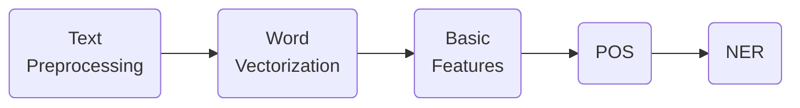

---
---

# Feature Engineering for NLP with python

Linked to ->
[[introduction_to_natural_lenguage_processing]]

## Basic features and readability scores

**Compute basic features** =>
- Number of words
- Number of characters
- Average word length
- Number of special characters

### Introduction to NLP feature engineering

> For every #ML algorithm -> data must be in tabular form and must be numerical.

##### Categorical data => Numerical: #One-hot-encoding 

Using pandas =>

```python
import pandas as pd
df = pd.get_dummies(df, columns=['sex'])
```


##### NLP Feature engineering steps



1. #text-preprocessing

	1. Convert to lowercase.
	2. Convert to a base form.

2. #words-vectors 
	1. Get a set of numerical features

3. **Extract basic features:**
	- Number of words
	- Number of characters
	- Average length of words
	- Special characters

4. #POS-tagging -> ==Parts-of-speech tagging==. Extract features from individual words:

- | Word | POS     |
| ---- | ------- |
| I    | Pronoun |
| have | Verb    |
| a    | Article |
| dog  | Noun    |
|      |         |

5. #NER => Named Entity Recognition
- *Does the numb refer to person, organization or country?*