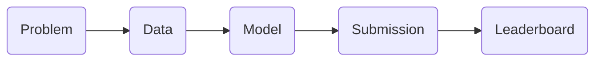
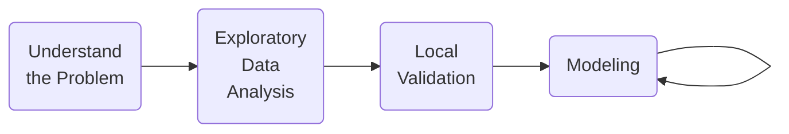
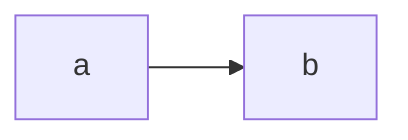

---
---

# Winning a Kaggle Competition in Python

Course description
> Kaggle is the most famous platform for Data Science competitions. Taking part in such competitions allows you to work with real-world datasets, explore various machine learning problems, compete with other participants and, finally, get invaluable hands-on experience. In this course, you will learn how to approach and structure any Data Science competition. You will be able to select the correct local validation scheme and to avoid overfitting. Moreover, you will master advanced feature engineering together with model ensembling approaches. All these techniques will be practiced on Kaggle competitions datasets.

## Kaggle competitions process

### Competitions overview

##### What is Kaggle?
- Web platform for data sciences and machine learning competitions
- Could be used for anyone
- Get practical experience on the real-world data
- Develop portfolio projects
- Meet a great Data Science community
- Try new domain or model type
- Keep up-to-date with the best performing methods 

#### Competition process




#### Training and test data

###### Competitions
- We will work with the *New York city taxi fare prediction*
- We also will work with the *Store Item Demand Forecasting Challenge* competition
- *Rental listing inquires*

```python
import pandas as pd

taxi_train = pd.read_csv('taxi_train.csv')
taxi_train.columns.to_list()
```

- The predictions are stored into a csv file, which could be submitted to kaggle.
	- It usually contains two columns => the id of the observation and the prediction
- Commonly, kaggle provides a sample submission.


```python
# Read the sample submission file
sample_submission = pd.read_csv('sample_submission.csv')
```

### Prepare your first submission
1. Determine the problem type: 
	- Classification or Regression
	- What type is the target variable

```python
import pandas as pd
from sklearn.ensemble import RandomForestRegressor

# Read the train data
train = pd.read_csv('train.csv')

# Create a Random Forest object
rf = RandomForestRegressor()

# Train a model using two features
rf.fit(X=train[['store', 'item']], y=train['sales'])

# Read test and sample submission data
test = pd.read_csv('test.csv')

# Get predictions for the test set
test['sales'] = rf.predict(test[['store', 'item']])

# Write test predictions using the sample_submission format
test[['id', 'sales']].to_csv('kaggle_submission.csv', index=False)
```


### Public vs Private leaderboard
Each competition specify the evaluation metric.

==The GOAL== => Build a model that optimizes the competition 

- Area unde the ROC 
- F1 Score
- Mean Log Loss 
- Mean Absolute Error => Regression
- Mean Squared Error => Regression
- Mean Average Precision at K => Ranking


Kaggle splits the test data into two sets (the split is unknown):
- Public: We can see the results regarding this set only
- Private: Used to determine the final standings at the end of the competition

![[Captura de Pantalla 2021-03-26 a la(s) 21.45.20.png]]

🚨🚨 We could ==overfit== over the Public Data 🚨🚨

![[Captura de Pantalla 2021-03-26 a la(s) 21.50.02.png]]

- The difference between Public and Private leaderboards standings is called a *shake-up*

## Dive into competition

### Understand the problem

#### Solution workflow



#### Understand the problem

##### Data Type
- Tabular
- Time Series
- Images
- Text
- A mix

##### Problem Type
- Classification
- Regression
- Ranking

##### Evaluation metric
Every competition has a single metric.
- ROC-AUC
- F1-Score
- MAE
- MSE


### Initial EDA
Find interesting patters performing EDA.
Goals of EDA:
- Size and descriptive statistics of the data
- Properties of the target variable
	- Class imbalance
	- Skew distributions
- Properties of the features
	- Correlation
	- Distributions
	- Types
- Generate ideas for feature engineering

#### Example Competition: Rental listing inquiries
Problem statement
- Predict the popularity of an  apartment rental listing

Target variable
- interest_level

Problem type
- Classification with 3 classes => 'high', 'medium', 'low'

Metric
- Multiclass logarithmic loss

### Local Validation

#### Holdout set
![[Captura de Pantalla 2021-03-26 a la(s) 22.26.19.png]]

#### Cross-validation
A better idea => Give us a better indication of how well our model will perform on unseen data.
![[Captura de Pantalla 2021-03-26 a la(s) 22.30.22.png]]

Stratified K-fold Cross-validation

```python
# Import StratifiedKFold
from sklearn.model_selection import StratifiedKFold

# Create a StratifiedKFold object
str_kf = StratifiedKFold(n_splits=3, shuffle=True, random_state=123)

# Loop through each split
fold = 0
for train_index, test_index in str_kf.split(train, train['interest_level']):
    # Obtain training and testing folds
    cv_train, cv_test = train.iloc[train_index], train.iloc[test_index]
    print('Fold: {}'.format(fold))
    print('CV train shape: {}'.format(cv_train.shape))
    print('Medium interest listings in CV train: {}\n'.format(sum(cv_train.interest_level == 'medium')))
    fold += 1
```

### Validation usage

#### Data leakage
- Leak in features -> Using data that will not be available in the real setting
- Leak in validation strategy -> Validation strategy differs the real-world situation

##### Time K-Fold cross-validation

![[Captura de Pantalla 2021-03-26 a la(s) 22.39.50.png]]

##### Validation pipeline

![[Captura de Pantalla 2021-03-26 a la(s) 22.40.54.png]]

![[Captura de Pantalla 2021-03-26 a la(s) 22.42.39.png]]

###### Overall Validation score
- Take the Mean Squared Error (MSE) for each fold separately, and then combine these results into a single number.

```python
from sklearn.model_selection import TimeSeriesSplit
import numpy as np

# Sort train data by date
train = train.sort_values('date')

# Initialize 3-fold time cross-validation
kf = TimeSeriesSplit(n_splits=3)

# Get MSE scores for each cross-validation split
mse_scores = get_fold_mse(train, kf)

print('Mean validation MSE: {:.5f}'.format(np.mean(mse_scores)))
print('MSE by fold: {}'.format(mse_scores))
print('Overall validation MSE: {:.5f}'.format(np.mean(mse_scores) + np.std(mse_scores)))
```


## Feature Engineering



![[Captura de Pantalla 2021-03-26 a la(s) 22.46.56.png]]

- Focus on local validation
- Try a change at time to improve the performance over the local validation


### Feature engineering
- It's better to create new features for train and test data simultaneously.
- Arithmetical features
- Datetime features
- Categorical features

#### Aritmetical Features
- *"House Prices: Advanced Regression Techniques"*
```python
# Look at the initial RMSE
print('RMSE before feature engineering:', get_kfold_rmse(train))

# Find the total area of the house
train['TotalArea'] = train['TotalBsmtSF'] + train['FirstFlrSF'] + train['SecondFlrSF']
print('RMSE with total area:', get_kfold_rmse(train))

# Find the area of the garden
train['GardenArea'] = train['LotArea'] - train['FirstFlrSF']
print('RMSE with garden area:', get_kfold_rmse(train))

# Find total number of bathrooms
train['TotalBath'] = train['FullBath'] + train['HalfBath']
print('RMSE with number of bathrooms:', get_kfold_rmse(train))
```

#### Datetime features
- *Taxi Fare Prediction Kaggle*
```python
# Concatenate train and test together
taxi = pd.concat([train, test])

# Convert pickup date to datetime object
taxi['pickup_datetime'] = pd.to_datetime(taxi['pickup_datetime'])

# Create a day of week feature
taxi['dayofweek'] = taxi['pickup_datetime'].dt.dayofweek

# Create an hour feature
taxi['hour'] = taxi['pickup_datetime'].dt.hour

# Split back into train and test
new_train = taxi[taxi['id'].isin(train['id'])]
new_test = taxi[taxi['id'].isin(test['id'])]
```


#### Categorical Features
![[Captura de Pantalla 2021-03-26 a la(s) 22.58.57.png]]

```python
# Concatenate train and test together
houses = pd.concat([train, test])

# Label encoder
from sklearn.preprocessing import LabelEncoder
le = LabelEncoder()

# Create new features
houses['RoofStyle_enc'] = le.fit_transform(houses['RoofStyle'])
houses['CentralAir_enc'] = le.fit_transform(houses['CentralAir'])

# Look at new features
print(houses[['RoofStyle', 'RoofStyle_enc', 'CentralAir', 'CentralAir_enc']].head())
```


##### One-Hot Encoding
![[Captura de Pantalla 2021-03-26 a la(s) 22.59.46.png]]


```python
# Concatenate train and test together
houses = pd.concat([train, test])

# Label encode binary 'CentralAir' feature
from sklearn.preprocessing import LabelEncoder
le = LabelEncoder()
houses['CentralAir_enc'] = le.fit_transform(houses['CentralAir'])

# Create One-Hot encoded features
ohe = pd.get_dummies(houses['RoofStyle'], prefix='RoofStyle')

# Concatenate OHE features to houses
houses = pd.concat([houses, ohe], axis=1)

# Look at OHE features
print(houses[[col for col in houses.columns if 'RoofStyle' in col]].head(3))
```

##### Binary Features
![[Captura de Pantalla 2021-03-26 a la(s) 23.00.55.png]]
- The most used is Target Encoder

#### Target Encoding
- One of the secret sauces of Kaggle competitions

- Label encoder provides distinct number for each category
- One-hot eoncoder crates new feature for each category value
- Creates a single column but keeps the correlation

##### Mean target encoding
```python
def test_mean_target_encoding(train, test, target, categorical, alpha=5):
    # Calculate global mean on the train data
    global_mean = train[target].mean()
    
    # Group by the categorical feature and calculate its properties
    train_groups = train.groupby(categorical)
    category_sum = train_groups[target].sum()
    category_size = train_groups.size()
    
    # Calculate smoothed mean target statistics
    train_statistics = (category_sum + global_mean * alpha) / (category_size + alpha)
    
    # Apply statistics to the test data and fill new categories
    test_feature = test[categorical].map(train_statistics).fillna(global_mean)
    return test_feature.values

```

```python
def train_mean_target_encoding(train, target, categorical, alpha=5):
    # Create 5-fold cross-validation
    kf = KFold(n_splits=5, random_state=123, shuffle=True)
    train_feature = pd.Series(index=train.index)
    
    # For each folds split
    for train_index, test_index in kf.split(train):
        cv_train, cv_test = train.iloc[train_index], train.iloc[test_index]
      
        # Calculate out-of-fold statistics and apply to cv_test
        cv_test_feature = test_mean_target_encoding(cv_train, cv_test, target, categorical, alpha)
        
        # Save new feature for this particular fold
        train_feature.iloc[test_index] = cv_test_feature       
    return train_feature.values
```

```python
def mean_target_encoding(train, test, target, categorical, alpha=5):
  
    # Get the train feature
    train_feature = train_mean_target_encoding(train, target, categorical, alpha)
  
    # Get the test feature
    test_feature = test_mean_target_encoding(train, test, target, categorical, alpha)
    
    # Return new features to add to the model
    return train_feature, test_feature
```

```python
# Create 5-fold cross-validation
kf = KFold(n_splits=5, random_state=123, shuffle=True)

# For each folds split
for train_index, test_index in kf.split(bryant_shots):
    cv_train, cv_test = bryant_shots.iloc[train_index], bryant_shots.iloc[test_index]

    # Create mean target encoded feature
    cv_train['game_id_enc'], cv_test['game_id_enc'] = mean_target_encoding(train=cv_train,
                                                                           test=cv_test,
                                                                           target='shot_made_flag',
                                                                           categorical='game_id',
                                                                           alpha=5)
    # Look at the encoding
    print(cv_train[['game_id', 'shot_made_flag', 'game_id_enc']].sample(n=1))
```

##### Beyond binary classification

Of course, binary classification is just a single special case. Target encoding could be applied to any target variable type:

-   For **binary classification** usually mean target encoding is used
-   For **regression** mean could be changed to median, quartiles, etc.
-   For **multi-class classification** with N classes we create N features with target mean for each category in one vs. all fashion.


### Missing Data

Numerical
- Mean/median imputation
- Constant value imputation

Categorical
- Most frequent category imputation
- New category imputation

![[Captura de Pantalla 2021-03-26 a la(s) 23.18.42.png]]

## Modeling
### Baseline model

![[Captura de Pantalla 2021-03-26 a la(s) 23.23.06.png]]

#### Baseline 1
```python
import numpy as np
from sklearn.metrics import mean_squared_error
from math import sqrt

# Calculate the mean fare_amount on the validation_train data
naive_prediction = np.mean(validation_train['fare_amount'])

# Assign naive prediction to all the holdout observations
validation_test['pred'] = naive_prediction

# Measure the local RMSE
rmse = sqrt(mean_squared_error(validation_test['fare_amount'], validation_test['pred']))
print('Validation RMSE for Baseline I model: {:.3f}'.format(rmse))
```

```python
# Get pickup hour from the pickup_datetime column
train['hour'] = train['pickup_datetime'].dt.hour
test['hour'] = test['pickup_datetime'].dt.hour

# Calculate average fare_amount grouped by pickup hour 
hour_groups = train.groupby('hour')['fare_amount'].mean()

# Make predictions on the test set
test['fare_amount'] = test.hour.map(hour_groups)

# Write predictions
test[['id','fare_amount']].to_csv('hour_mean_sub.csv', index=False)
```

```python
from sklearn.ensemble import RandomForestRegressor

# Select only numeric features
features = ['pickup_longitude', 'pickup_latitude', 'dropoff_longitude',
            'dropoff_latitude', 'passenger_count', 'hour']

# Train a Random Forest model
rf = RandomForestRegressor()
rf.fit(train[features], train.fare_amount)

# Make predictions on the test data
test['fare_amount'] = rf.predict(test[features])

# Write predictions
test[['id','fare_amount']].to_csv('rf_sub.csv', index=False)
```

### Hyperparameter tuning
![[Captura de Pantalla 2021-03-26 a la(s) 23.29.53.png]]

![[Captura de Pantalla 2021-03-26 a la(s) 23.31.57.png]]

```python
import itertools

# Hyperparameter grids
max_depth_grid = [3, 5, 7]
subsample_grid = [0.8, 0.9, 1]
results = {}

# For each couple in the grid
for max_depth_candidate, subsample_candidate in itertools.product(max_depth_grid, subsample_grid):
    params = {'max_depth': max_depth_candidate,
              'subsample': subsample_candidate}
    validation_score = get_cv_score(train, params)
    # Save the results for each couple
    results[(max_depth_candidate, subsample_candidate)] = validation_score   
print(results)
```


### model Ensembling

#### Model blending
- Geometric mean for classification


#### Model Stacking
![[Captura de Pantalla 2021-03-26 a la(s) 23.36.18.png]]


Now it's time for **stacking**. To implement the stacking approach, you will follow the 6 steps we've discussed in the previous video:

1.  Split train data into two parts
2.  Train multiple models on Part 1
3.  Make predictions on Part 2
4.  Make predictions on the test data
5.  Train a new model on Part 2 using predictions as features
6.  Make predictions on the test data using the 2nd level model

```python
from sklearn.linear_model import LinearRegression

# Create linear regression model without the intercept
lr = LinearRegression(fit_intercept=False)

# Train 2nd level model on the Part 2 data
lr.fit(part_2[['gb_pred', 'rf_pred']], part_2.fare_amount)

# Make stacking predictions on the test data
test['stacking'] = lr.predict(test[['gb_pred', 'rf_pred']])

# Look at the model coefficients
print(lr.coef_)
```

### Final tips
- Save information
- Save folds to the disk
- Save model runs
- Save model predictions
- Save performance results

#### forum and kernels
- Competitions discussion
- Scripts and notebooks shared by the participarts
- Cloud computational enviroments

- ![[Captura de Pantalla 2021-03-26 a la(s) 23.43.37.png]]
- ![[Captura de Pantalla 2021-03-26 a la(s) 23.44.53.png]]

