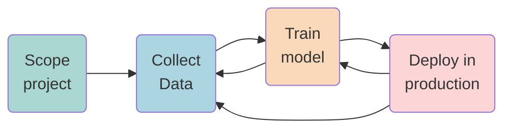

---
---

# A chat with Andrew on MOLps
#AndrewNg

## Life-cycle of an ML Project

1. Define the project
2. Define and collect data
3. Training, error, analysis & and iterative improvement
4. Deploy, monitor and maintain system

### Data is Food for AI

![[Captura de Pantalla 2021-03-25 a la(s) 9.53.01.png]]

### Making it systematic