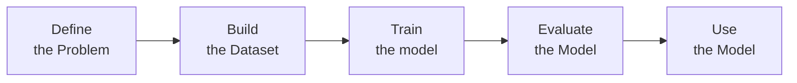

---
---

# Introduction to Machine Learning

Machine Learning follows an iterative process

## Model inference
Model inference involves:
- Generating predictions -> ==Supervised==
- Finding patterns in the data -> ==Unsupervised==
- Using a trained model
- Testing the model on data it has not seen before

