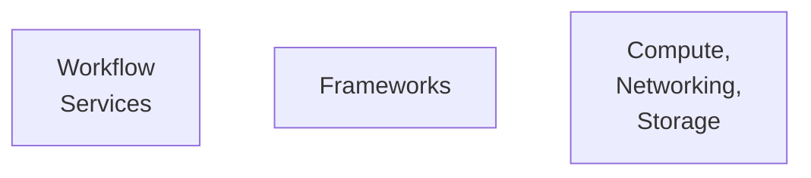

---
---

# Machine Learning with AWS
#AWS 

### Why AWS?
- Put ML in the hands of every developer.
- AWS offers:
	- The broadest and deepest set of artificial intelligence and machine learning services
	- AWS #SageMaker
	- AWS offers the most comprehensive cloud offering optimized for machine learning

## AWS AI services
- AWS pre-trained AI services
- Industry-specific solutions:
	- Add intelligence to a wide range of applications in different industries

## Amazon Sagemaker
Amazon SageMaker is a fully managed service that removes complexity from ML workflows
- Deploy machine learning for a wide range of use cases.

## Machine learning on AWS 

### AI services
Pretrained AI services. Ready to use models focused to a wide range of applications:

- ==Health AI==
	- Amazon transcribe medical => Medical speech to text
- ==Industrial AI==
	- Amazon Monitron => Data analysis platform
- ==Anomaly Detection==
	- Amazon lookout for metrics
- ==Chatbots==
	- Amazon Lex
- ==Personalization==
	- Amazon personalize
- ==Forecasting==
	- Amazon Forecasting
- ==Fraud==
	- Amazon Fraud Detector
- ==Code Development==
	- Amazong codeguru and Devops Guru
- ==Vision==
	- Amazon Recognition
- ==Speech==
	- Amazon Polly
- ==Text==
	- Amazon translate
	- Amazon textback
- ==Contact Centers==
	- Contact lens
- ==Search==
	- Amazon Kendra

### ML Services => SageMaker
With these services we can:
	- build, train,  and deploy the models fast.
	- using Amazon #SageMaker 
		=> A fully managed service thath removes complexity form ML workflows.
		
##### Machine Learning Development Process
![[Captura de Pantalla 2021-07-01 a la(s) 22.02.36.png]]

##### Amazon SageMaker examples
![[Captura de Pantalla 2021-07-01 a la(s) 22.03.49.png]]

1. **==Amazon Sagemaker Studio==**
	- Integrated development environment to build, train, and deploy ML models at scale
2. **==Amazon Sagemaker Distributed Training==**
	- Train large Deep learning models faster by automatically partitioning your model and training data
3. ==**Amazon Sagemaker Clarify**==
	- Brings transparency to the model by detecting bias across the ML workflow and explaining model behavior

### ML infrastructure and frameworks

# Educational Devices

### Getting Started
- ==AWS Deeplens==
	- To learn computer vision

- ==AWS DeepRacer==
	- To learn Reinforcement learning

- ==AWS DeepComposer==
	- Learn generative artificial intelligence by creating music

- ==AWS ML Training and Certification==
	- Curriculum used to train Amazon developers
