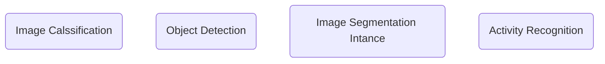

---
---

# Quizzes

# L2

- Machine learning:
	- Modern software development technique that enables computers to solve problems by using examples of real-world data
- Model:
	- Is an extremely generic program, made specific by the data used to train it
- Training algorithms:
	- Work through an iterative process where the current model iteration is analyzed to determine what changes can be made to get closer the goal
- Model inference
	- Is when tranied model is used to generate predictions

## Major steps in the machine learning process
1. Define the problem
	1. Very specific task => Supervised or Unsupervised
2. Build the dataset
3. Train the model
4. Evaluate the model
5. Use the model

#### Terminology
- Clustering => Unsupervised, notural groupings in the data
- Categorical label: discrete of possible values
- Continuous Regression label

#### Questions or task for machine learning
- https://docs.aws.amazon.com/machine-learning/latest/dg/machine-learning-problems-in-amazon-machine-learning.html
- Solving business problems with amazon machine learning
	- Binary classification problems:
		- Whether buy or not buy a product
		- Predict spam/no-spam
		- Reviewed by a person or a bot
	- Examples of multiclass classification
		- Type of product
		- Type of movie (genre)
	- Regression
		- Temperature, number of products to sell
		- Number of days

## Define the problem test
Which of the following problem statements fit the definition of a regression-based task?
- Determine the expected reading TIME
- Predict shoe size

- Inpute: Statistical tools which can be used to calculate missin values from the dataset
- Outliers: Data points that are significantly different from others in the same sample
	- Outlier detection =>

- Data requirements will change based on the machine learning task we are using.
- models are not universal and data is relevant
- Data needs to be formatted so that is compatible with the model and the model training algorithm
- Data visualizations are not the only way to identify outliers
- We need to constantly check the new data a trained model recieves

### Terminology
- Model parameters =>
	- Weights or biases
- Loss function =>
	- Used to codify the models distance from its goal.

The end to end training process
- Feed the training data into the model
- Compute the loss function on the results
- Update the model parameters in a direction that reduces the loss

Stop condition:
- Based on training time
- The number of training cycles

Advice from the experts:
- use machine learning frameworks
- Use a process called model selection -> determine which model to use
- Hyperparameters are settings on the model which are not changed during training but can affect how quickly or how reliably the model trains.
- Be prepared to iterate

Programatic problem solving with machine learning is rarely an exact science, and you might have assumptions about your data or problem which turn out to be false.

- Linear models:
	- Describe the relationship between a set of input numbers and a set of output numbers through a linear funciton
	- Classification uses a logistic model -> Range 0 to 1
- Three based models:
	- They learn to categorize or regress by building an extremely large structure of netsted if/false blocks
- Deep learning models:
	- Based conceptually on how the human brain works
	- Composed on a set of neurons connected by weights and layers
	- Examples:
		- Feed Forward Neural networks -> structured on a set of layers
		
Model inference involves:
- Generating predictions
- Finding pattherns in data
- Using a trained model
- Testing the model on data it has not seen before

Building a dataset:
- Data collection
- Data Exploration
- Data Cleaning
- Data visualization
	- Working with data that helps stakeholders sunderstand the data => Outliers and trends
	- 

Metrics for regression:
- Mean Squared Error
- Root mean squared error
- Mean absolute error

Ridge regression -> REgularized linear model => L2 penalty

Linear models typically fail when there is no helpful linear relationship between the input variables and the label

### Clustering
- bag of words => Extract features from texts. it counts many times a word appears in a document
- Data Vectorization -> Converts non numeric data into a numeric format
- Sihouette coefficient => A score from -1 to 1 describing the clusts found during modeling. => 0 indicates overlapping clusters, scores less than zero indicate data points assigned to incorrect cluster.
- A score close to 1 idicates succesful indentification of discrete non-overlaping clusters

## ML steps
1. Define the problem
2. Build the dataset
3. Train the model
4. Evaluate the model
5. Use the model

A loss function is a model hyperparameter

Reinforcement learning, the algorithm figures out which atciions to take in a situation to maximize a reward

# Lesson 3
## Computer vision

- Started in 1960 academia. Exploited since 2010
- Simple components of neural networks:
	- *Input layer*: Receives the data
	- Hidden layer: Finds features in the input data taht have predictive power based on the labels provided during training.
		- Feature extraction
	- Output layer: Generates a prediction

### 1️⃣ Image classification

-   It is the most common application of computer vision used today
-   _What is in this image?_

### 2️⃣ Object detection

-   To identify whether one or more objects are presented in an image
-   To know if there are multiple instances of the same object are present.
-   To know if objects form different classes appear in the same image.

### 3️⃣ Instance or Semantic segmentation

-   A pixel-by-pixel approach
-   Not just identifies if an object is presented in the image but it also identifies which part of the image is part of the object.

### 4️⃣ Activity recognition

-   Based around videos rather than just images.
-   Time dimension added
-   Models are able to detect changes that occur over time.

#### Questions
**Image Segmentation:**
- Which pixels in an image represent our object of interest?
- Que regiones de la imagen pertenecen al objeto de interest
- Is like image detection but localizing where they are
	- used to distingush buildings, roads, etc in a map

**Image Detection:**
- How many objects of interest are in the image
- What different classes of objects appear in the image
	- Counting parking lots

**Activity Recognition**
- Analyze videos to understand human actions
- Used for video captioning

**Image Classification**
- Best for sorting application ?
- For text detection

## Reinforcement learning

Terms
1. Agent:
	1. Trained to achieve a goal based on the feedback it recieves as it interacts with an environment.
	1. It collects a number as a reward for each action it takes
1. Environment
2. State
3. Action:
	1. Help the agent achieve its goal are incentivized with higher numbers
4. Reward
5. Episode

##### Learning objective
Maximize total cumulative reward, over time....

**State**:
- The information within the environment that is currently visible or known to an agent
- An image captured by the camera
Action:
- What the agent can do every state in order to be closer to achieve the goal
Reward:
- The feedback given to an agent for each action it takes in a given state.
Agent:
- The piece of software being traned that interacts with the environment
- It makes decisions in an environment to reach a goal
- In AWS the agent is the AWS DeepRacer car
- The goal is to finish laps around the track as fast as it can, avoiding, obstacles
Environment:
- The surrounding area the agent interacts with
- In AWS is the track or the simulator or the real life
Episode:
- Period of trial and error when an agent makes decisions and gets feedback from its environment
	- Trail error
	- Decisions
	- Feedback from environment
Reward function:
- The incentive plan that assigns numbers as rewards to different aspects of the current state
Model training algorithm:
- Tells the agent and motivates it to do the task
Action space:
- The set of valid actions available to an agent as it interacts with an environment
	- Discrete action space:
		- Represents all of an agents possible actions for each state in a finite set of steering angle
		- Allows the agent to select an action from a range of values defined for each state
- Go in a given direction, accelerate or brake
Hyperparameters:
- Varaibles that control the performance of the agent during training.
	- Learning rate

Key points to remember about **reward functions:**

-   Each state on the grid is assigned a score by your reward function. You incentivize behavior that supports your car’s goal of completing fast laps by giving the highest numbers to the parts of the track on which you want it to drive.
-   The [reward function](https://docs.aws.amazon.com/deepracer/latest/developerguide/deepracer-reward-function-input.html?utm_source=Udacity&utm_medium=Webpage&utm_campaign=Udacity%20AWS%20ML%20Foundations%20Course) is the [actual code](https://docs.aws.amazon.com/deepracer/latest/developerguide/deepracer-reward-function-examples.html?utm_source=Udacity&utm_medium=Webpage&utm_campaign=Udacity%20AWS%20ML%20Foundations%20Course) you'll write to help your agent determine if the action it just took was good or bad, and how good or bad it was.

The training algorithm tells the model to gather as many rewards as possible
	- It defines the learning objective
	- Maximize total cumulative reward

AWS DeepRacer uses 2 training algorithms for RL, Soft Actor Critic (SAC) and Proximal Policy Optimization (PPO)
- Soft Actor Critic => Exploration
	- Embraces Exploration
	- Lacks stability
	- Only works with a continuos action space
	- More data efficient
- Proximal Policy Optimization => PPO
	- More stable
	- Works both on discrete and continuous actions
	- Data hungry

Trade off for decreassing or increassing the learning rate hyperparameter
- Fater training time vs higher model quality
- Higher learning rate makes training time faster but a lower learning

#### Exploration vs Explotation
Exploration =>
- Experience helps to become more confident about the actions it chooses
Explotation =>
- Exploit or use information from previous experiences to help it reach its goal

An agent should exploit known information from previous experiences to achieve higher cumulative rewards.
But also needs to explore to gain new experiences that can be used in choosing the best actions in the future

"Exploration" is when an agent wanders to discover what actions lead to what feedback in the form of digital rewards. 
"Exploitation" is using experience to decide.

Key points to remember about the **reward graph:**

-   While training your car in the AWS DeepRacer console, your training metrics are displayed on a _reward graph_.
-   Plotting the total reward from each episode allows you to see how the model performs over time. The more reward your car gets, the better your model performs.

Key points to remember about **AWS DeepRacer:**

-   [AWS DeepRacer](https://aws.amazon.com/deepracer/?utm_source=Udacity&utm_medium=Webpage&utm_campaign=Udacity%20AWS%20ML%20Foundations%20Course) is a combination of a [physical car](https://aws.amazon.com/deepracer/robotics-projects/?utm_source=Udacity&utm_medium=Webpage&utm_campaign=Udacity%20AWS%20ML%20Foundations%20Course) and a [virtual simulator](https://console.aws.amazon.com/deepracer/home?region=us-east-1&utm_source=Udacity&utm_medium=Webpage&utm_campaign=Udacity%20AWS%20ML%20Foundations%20Course#createModel) in the [AWS Console](https://aws.amazon.com/console/?utm_source=Udacity&utm_medium=Webpage&utm_campaign=Udacity%20AWS%20ML%20Foundations%20Course), the [AWS DeepRacer League](https://aws.amazon.com/deepracer/league/?utm_source=Udacity&utm_medium=Webpage&utm_campaign=Udacity%20AWS%20ML%20Foundations%20Course), and [community races](https://console.aws.amazon.com/deepracer/home?region=us-east-1&utm_source=Udacity&utm_medium=Webpage&utm_campaign=Udacity%20AWS%20ML%20Foundations%20Course#communityRaces).
-   An AWS DeepRacer device is not required to start learning: you can start now in the AWS console. The 3D simulator in the AWS console is where training and evaluation take place.

#### Reward graph
### Part 2: Inspect your reward graph to assess your training progress

As you train and evaluate your first model, you'll want to get a sense of its quality. To do this, inspect your reward graph.

**Find the following on your reward graph:**

-   Average reward:
	-   Average reward the agent earns during a training iteration. Calculated across all episodes
-   Average percentage completion (training):
	-   Shows the performance of the vehicle while experince is bein gathered
-   Average percentage completion (evaluation):
	-   Average porcentage of the track completed by the agend in all episodes during evaluation
-   Best model line:
	-   Which of the model iterations had the highest average progess during the evaluation.
-   Reward primary y-axis:
	-   Reward earning during a training iteration.
-   Percentage track completion secondary y-axis:
	-   Percentage of the track the agend completed
-   Iteration x-axis

![[Pasted image 20211008224251.png]]

## Summary

Reinforcement learning is used in a variety of fields to solve real-world problems. It’s particularly useful for addressing sequential problems with long-term goals. Let’s take a look at some examples.

-   RL is great at **playing games**:
    -   **Go** (board game) was mastered by the AlphaGo Zero software.
    -   **Atari classic video** games are commonly used as a learning tool for creating and testing RL software.
    -   **StarCraft II,** the real-time strategy video game, was mastered by the AlphaStar software.
-   RL is used in **video game level design**:
    -   Video game level design determines how complex each stage of a game is and directly affects how boring, frustrating, or fun it is to play that game.
    -   Video game companies create an agent that plays the game over and over again to collect data that can be visualized on graphs.
    -   This visual data gives designers a quick way to assess how easy or difficult it is for a player to make progress, which enables them to find that “just right” balance between boredom and frustration faster.
-   RL is used in **wind energy optimization**:
    -   RL models can also be used to power robotics in physical devices.
    -   When multiple turbines work together in a wind farm, the turbines in the front, which receive the wind first, can cause poor wind conditions for the turbines behind them. This is called **wake turbulence** and it reduces the amount of energy that is captured and converted into electrical power.
    -   Wind energy organizations around the world use reinforcement learning to test solutions. Their models respond to changing wind conditions by changing the angle of the turbine blades. When the upstream turbines slow down it helps the downstream turbines capture more energy.
-   Other examples of real-world RL include:
    -   **Industrial robotics**
    -   **Fraud detection**
    -   **Stock trading**
    -   **Autonomous driving**

### AWS Deep lens key components
- Collect your data
- Train your model
- deploy your model
- View model output

## Generative

Discriminative algorithms deal with createing new data from the dataset => False, they deal with creating/generating new data

- A limiation of generative algorithms is that it can only generate new things based on the style of data it has been trained on:
	- True -> Since data make the model specific, the things the model creates should be based from the data it was trained on

- Generative Adversial Networks => Put to newgorks against each other
- Generative AI
	- It is an unsupervised learning task:
		- Some times view as a semi-supervised task
	- An untrained GAN does not need a label dataset.
	- The training occurs by generating a classification problem between the two networks. The labels of this problem are not provided with the data, but a trivial consequence of the training process. => Trival label or fake or real=> These are not provided with the data
	- Generator networks in GANS not always require input data
	- Generator Loss =>
		- Loss function of the generator => Generator loss => Measures how far the generated data deviate from real data
	- Discriminator loss =>
		- Measures how well the differnetiation between real and fake data works

AutoRegressive Models -> ARCNN
- Relies on previous time data to generate new accurate data

Transformers:
- Sequential in nature

AWS decomposer:
Edit Event ->
	- Event when a note is added or removed from the input track during inference
	- Piano roll => The 2D matrix that represents music tracks -> Music is on x axis and pitch on y axis
	
	
# L4
- Clean code => simple, concise, and readable
- Modular coder => 
	- Prevents writing unnecessary code
	- Helps improve readability
- Production code
	- Software running on productions servers being used by clients
- Production quality code
	- Code that meets expectations for production in readability and efficiency, modularity
- Refactoring code:
	- Restructuration of code to imporve internal structure and imporve efficiency without changing external functionality
	- Internal strcture change without external functionality
	- It makes the code easier to mantain which reduces workload in the long run
- Naming variables;
	- Verbs => functions
	- Nouns => VAriables
	- Booleans => is or has
- PEP 8 => Python enhacement proposal used as the standard style guide for python code
- DRY => Dont repeat yourself
- Arbitrary variable names
	- Can be useful to make the code more redeable
- Make code more efficient:
	- Reducing runtime
	- Reducing memory usage
- Vector operations are faster => Parellelizable
- Documentation =>
	- Can make code navigation easier
	- Help clarify complex parts of the code
	- Convey the decisions made for the code
- 3 types of documentation:
	- Line Level
	- Function module level -> Docstrings functions and classes
	- Project level -> Readme file
- README file 
	- Potential users and or contributions

# L5
### Software Engineering practices
- Why do we create tests for our code?
	- Because some problems errors in code arent easily detectable
	- Tests help catch those errors
- Test-driven development (TEST-DRIVEN DEVELOPMENT) =>
	- Emerging software development process in which  sofware requirements are first coverted to test cases before software is fully developed
	- Test cases
- Unit test:
	- Type of test that covers a small part of code independently from the rest of the program
- Code review:
	- Helps catch errors and checks if standards/conventions are being met while also simultaneously serves the purpose of shring knowledge among the team

# L6
### Object-oriented programming
- Difference between objects and classes
	- Objects instances
	- Classes -> Blueprints of objects
- Two essential parts of an object/class and describe both of them
	- Methods -> 
	- Attributes -> Characteristics of a certain object class
- 