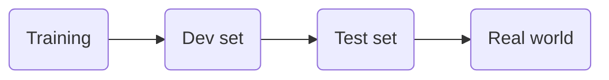

---
---

# Machine Learning Stragegy

#### Ideas to improve an ML
- Collect more data
- More diverse training set
- Train algorithm longer with gradient descent
- Try bigger or smaller network
- Try dropout
- Add $L_2$ regularization 
- Network architecture
	- Activation functions
	- Number of Hidden layers
	- Number of Hidden units

## The idea
#### Which property affects the performance of the model at each step?

***

## Orthogonalization

> _Orthogonalization is **a system design property that ensures that modification of an instruction or an algorithm component does not create or propagate side effects to other system components**_

#### Chain of assumptions in ML
- So ==orthogonalization== will allow us to tune a set of properties sequentially, at each step of the *Chain of assumptions*, without affecting the previous configurations.
	- So, at each steps we need to focus on the respective properties we can modify:

![[Captura de Pantalla 2021-09-11 a la(s) 20.24.37.png]]

- ❌  <mark style='background-color: #FFA793 !important'>Early stopping</mark> -> it is an example of a ==non-orthogonalized== feature.
	- It affects the performance of both `training` and `validation/developing` sets