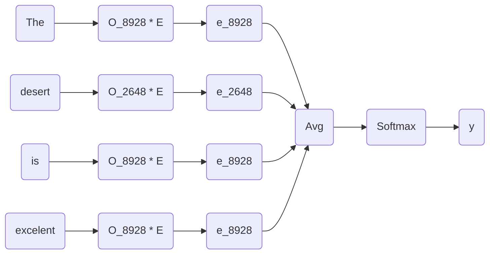

---
---

# Sentiment Classification

**Sentiment Classification** is the automated process of identifying options in text and ==labeling== them as positive, negative, or neutral, based on the emotions customers express within them.
- Using word embeddings is possibly to obtain good results even with relative small datasets.

## Sentiment Classification problem

| $X$                     | $y$          |
| ----------------------- | ------------ |
| The dessert is excelent | ⭐️⭐️⭐️⭐️ |
| Service was quite slow  | ⭐️⭐️       |
| ....                        |        ....      |

### Simple Classification Model

1. Use the #One-hot-encoded representation of words.
2. Multiply each $O_w$ vector by the embedding matrix $E$ to obtain $e_w$
	- Let's say that $|e_w| = 3,000$

|Representation| $X$                     | $y$          |
|---| ----------------------- | ------------ |
|Text| The dessert is excelent | ⭐️⭐️⭐️⭐️ |
|Vocab index| 8928, 2468, 4694, 3180  |              |
|Embedding|  $e_{8928}$, $e_{2468}$, $e_{4694},$ $e_{3180}$                      |              |

3. $E$ should be trained with a huge dataset
4. <mark style='background-color: #9CE684 !important'>Sum</mark> or <mark style='background-color: #FFA793 !important'>Average</mark> all of the $e_w$ vectors.
	- This gives us a $v_{Avg} \in \mathbb{R} ^{3,000}$ vector
5. Use a #softmax function to predict $\hat y$

#### Issues:
- ⚠️ This simply approach ignore word order
- The sentence below will be missclassified:
	- *Completely lacking in good taste, good service, and good ambience*
	- Because the word *good* appears many times

### Use a [[RNN]] model for sentiment classification

1. Use the embedding vectors to feed the #RNN model
2. At the last time step $t = T$ use a #softmax function over $a^T$
	- A Many-to-one #RNN

![[Captura de Pantalla 2022-01-05 a la(s) 9.45.58.png]]