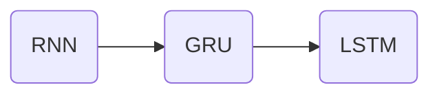

---
---

# Transformer Networks

> Transformers are an architecture that has completely taken the #NLP world by storm

- #TransformersNetwors are applied to #ZeroProblems

## Transformer Network Motivation

- Increased in complexity -->
	- As we move from #RNN, to #GRU, to #LSTM, the models became more complex

- All these models are ==Sequential models==
	- They ingest the `input` one Token at each time step 
	- 🔴 Thus, each unit is like a *bottleneck* to the flow of information
	- Because to compute the `output` at time $t$ -> we have to compute time $t-1$

## The Transformer Network

- Published by Vaswani, et al. (2017) - *Attention is All you need*
- Allows to run a lot more of these computations for an entire sequence in parallel
	- It ingest an entire *sentence* (`input`) all at the same time rather than sequentially
- <mark style='background-color: #FFA793 !important'>Attention based representations</mark> + <mark style='background-color: #9CE684 !important'>CNN</mark>
	- The major innovation of the transformer architecture:
	- Combines Attention Mechanism with #CNN network ==style of parallel processing==.
		- Which allows to process multiple units at time

### Two key ideas

- ==Self-Attention==
- ==Multi-HEad Attention==

## Self-Attention

- **Self-attention** => Computed in a #CNN style processing
	- We create ==attention-based representations== **for each** of the words (tokens) in the input sentence.
		- Self-Attention of token $t$ will be represented by $A^<t>$
		- This is a <mark style='background-color: #FFA793 !important'>Rich representation</mark> of the token
	- These representations combine the Embedding representation of each token with its context determined by the surrounding tokens
		- This is similar to the concept of **attention** in #LSTM and #RNN^[[27. W3 - Attention Model]] --> Which is computed *sequentially*
		- <mark style='background-color: #FFA793 !important'>The difference</mark> is that with Transformers this attention representations are computing in *parallel*

### Self-Attention equation

==Self-attention== ( #SelfAttention ) is computed as:

$A^i(q, K, V) = \sum_i \frac{\mathbf{exp} (q \cdot k ^{<i>}) }{\sum_j \mathbf{exp} (q \cdot k ^{<j>})} v^{<i>}$

- The equation above is related to how **attention** is computed with #RNN
	- The denominator involves a #softmax term

![[Captura de Pantalla 2022-01-25 a la(s) 14.17.00.png]]

### The `query`, the `key`, and the `value`
- For each token $i$ you have three **vectors**:
	- $\mathbf{q}^<i>$: `query`
		- A vector $q^<i>$ belonging to current token $i$ been evaluated
		- Let's us ask the question about the token
	- $\mathbf{K}^<i>$: `key`
		- A vector of how the token $j$ affects the `query` token $i$
		- Let us find the most relevant answer to the `query` question regarding the rest of the tokens
	- $\mathbf{V}^<i>$: `value`
		- A vector of values corresponding the token $i$ been evaluated.
- These vectors are computed from the ==Embedding== representations of each words and from the <mark style='background-color: #9CE684 !important'>Weighted Matrices</mark> $WQ$, $WK$, and $WV$ <-- Contain learnable parameters
- The <mark style='background-color: #FFA793 !important'>key advantage of this rich representation</mark> is that it is not a fixed representation (like plain embeddings)
	- Instead the *self-attention* mechanism lets to incorporate information from the rest of the tokens => The entire sequence

![[Captura de Pantalla 2022-01-25 a la(s) 14.36.08.png]]

### Notation => Scaled-dot product attention

The attention for all tokens is represented as:

$\mathbf{Attention}(\mathbf{Q}, \mathbf{K}, \mathbf{V}) = \mathbf{softmax}\left(\frac{\mathbf{Q}\mathbf{K}^T}{\sqrt{d_k}}\right)\mathbf{V}$
- The equation above is a vectorized representation.
	- $d_k$ is a term to scale the dot product to avoid #ExplodingGradients^[[4. W1 - Vanishing Gradients with RNN]]
- It is also known as ==Scaled-dot product attention==
	
![[Captura de Pantalla 2022-01-25 a la(s) 14.50.49.png]]

## Multi-Head Attention

> Just a big for loop over the #SelfAttention mechanism

A <mark style='background-color: #93EBFF !important'>HEAD</mark> is time we calculate attention for a sequence.
- A ==Multi-Head Attention== is basically compute `HEAD` multiple times

## The Transformer Network

### Encoder Block
